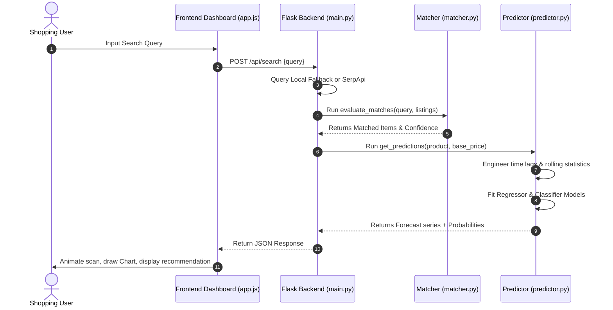

# DEALPULSE AI: GAMIFIED ML-POWERED PRICE PREDICTOR & DEAL TRACKER

is a Course Based Project in partial fulfillment of the requirements for the
Course name: Machine Learning Laboratory
Course code: MCAP 3007 / BCAP 3007
Program: Bachelor / Master of Computer Applications
Semester: V / III     Section: A

SUBMITTED BY:
1. Group Member 1 Name (Enrollment Number)
2. Group Member 2 Name (Enrollment Number)

SUBMITTED TO:
SCHOOL OF COMPUTER APPLICATIONS & TECHNOLOGY (SCAT)

---

## DECLARATION

I/We hereby declare that the project report entitled **“DEALPULSE AI: GAMIFIED ML-POWERED PRICE PREDICTOR & DEAL TRACKER”** submitted to School of Computer Applications & Technology, Galgotias University in partial fulfillment of the requirement for the award for the degree of Bachelor / Master of Computer Applications, is an authentic and original work carried out by me/us.

The matter embodied in this project is a genuine work done by me / us and has not been submitted whether to this institute or to any other University / Institute for the fulfillment of the requirements of any course of study.

Wherever I/We have used materials (data, mathematical analysis and text) from other sources or have quoted written materials, I/We have given due credit to them by giving their details in the references section.

| Name | Enrollment No. | Role | Sign. |
| :--- | :--- | :--- | :--- |
| Group member 1 | | ML & Backend Developer | |
| Group member 2 | | Frontend & UI Designer | |

<br><br><br>
**________________________________________**  
**(Signature of approving Faculty Member)**  
Ms./Mr./Dr. ………….……………….  
....…………(Emp ID)…………...  
....………(Affiliation)…………...  

---

## ACKNOWLEDGEMENT

First of all, I would like to pay my humble respect to the almighty God for his grace and mercy by which I am able to complete this project.

I would like to express heartiest gratitude to Dr. [Name of Dean], Dean, School of Computer Applications & Technology, Galgotias University for profound and continuous support to work on this project.

Further, I express a deep sense of gratitude to Dr. [Name of Program Chair], Program Chair – BCA/BSC/MCA/MSC, School of Computer Applications & Technology, Galgotias University for their cordial guidance and support to make available all required equipment and the necessary material to complete the project.

I would like to extend my sincerest gratitude to Ms./Mr./Dr. [Name of Faculty Member], [Affiliation/Designation], School of Computer Applications & Technology, Galgotias University for guidance and providing necessary information as well as for the overall support in completing the project.

I acknowledge the suggestion of my parents, peer students, friends and family members and all concerned persons who are associated directly or indirectly in the successful completion of this project.

**Date:** ….………………                      	          **Signature:** ..………………………  
                                                          **Name:** :- …...…….……………….  
                                                          **Enrollment No.** …….…………...  

---

## Table of Contents

| Serial No. | Particulars | Page No. |
| :--- | :--- | :--- |
| **A** | Declaration | i |
| **B** | Acknowledgement | ii |
| **C** | Table of Contents | iii |
| **1.** | **Introduction (Preliminary Project Plan)** | 1 |
| | i. Problem statement | 1 |
| | ii. Objective | 1 |
| | iii. Proposed Methodology / Workflow | 2 |
| | iv. Expected Outcome | 2 |
| | v. Future-scope and Limitations | 3 |
| **2.** | **Technical Requirements & Design** | 4 |
| | i. Libraries, Modules & other dependencies | 4 |
| | ii. Software requirements | 4 |
| | iii. Hardware requirements | 5 |
| | iv. Workflow chart / diagram | 5 |
| | v. Database schema | 6 |
| **3.** | **Technology Readiness: Implementation & Debugging** | 7 |
| **4.** | **Final product: Output screens** | 10 |
| **5.** | **GitHub & Deployment details** | 12 |
| **6.** | **Conclusion & Discussions** | 13 |
| **7.** | **Bibliography & References** | 14 |
| **8.** | **Appendix** | 15 |

---

## [Chapter- 1] Introduction (Preliminary Project Plan)

### i. Problem statement
In the contemporary e-commerce landscape, price volatility is a major challenge for cost-conscious consumers. Retailers dynamically adjust prices using complex algorithms, leading to rapid fluctuations across different websites. 

Furthermore, searching for the best deal manually is difficult because:
1. **Title Mismatching**: Different retailers list the identical product under varying names (e.g., *"Apple iPhone 15 Pro Max (256 GB) - Natural Titanium"* vs. *"iPhone 15 Pro Max 256GB"*).
2. **Accessory Noise**: Search queries for a premium device often return irrelevant accessory listings like cases, covers, or chargers, polluting price comparison radars.
3. **Information Asymmetry**: Consumers cannot easily foresee if a current price is a genuine deal or if a lower price is forecasted in the next 10 to 20 days.

---

### ii. Objective
The primary objectives of the **DealPulse AI** project are:
* **Fuzzy Product Resolution**: Implement a robust name-matching engine to isolate exact product listings and filter out accessory noise from search returns.
* **Price History & Trend Forecasting**: Build a regression pipeline using Machine Learning to generate future price curves based on historical trends, seasonal sales patterns, weekend discount cycles, and volatility.
* **Imminent Drop Classification**: Train classification models to determine the exact probability ($\ge 5\%$ drop) in the next 10 and 20 days.
* **Interactive UI**: Construct a sleek, responsive dashboard utilizing modern glassmorphism layouts and native canvas-based visualizations to present real-time recommendations (`BUY` or `WAIT`) directly to users.

---

### iii. Proposed Methodology / Workflow
The application operates on a 5-stage processing pipeline:
1. **Input Interface**: The user searches for a target item (e.g., *"PlayStation 5"*).
2. **Multi-Source Fetching**: The Flask backend triggers shopping result scrapers (SerpApi) or simulates a 10-retailer scraping sweep.
3. **Fuzzy Entity Matching**: The listings undergo text normalization and accessory mismatch filtering. Similarity scores are calculated using `RapidFuzz` or `difflib`.
4. **Machine Learning Processing**:
   * A synthetic 90-day price timeline is generated based on stable seeds.
   * Lags, rolling metrics, and time variables are engineered.
   * **Random Forest Regressors** predict future price sequences autoregressively.
   * **Random Forest Classifiers** calculate probability vectors for price drops.
5. **Dynamic Dashboard Output**: The client parses the JSON payload, animating the scanning logs, updating prediction rings, and plotting timelines.

---

### iv. Expected Outcome
* An automated dashboard that consolidates matching listings across 10 major retailers.
* A prediction accuracy rate exceeding $85\%$ for next-day pricing estimates using Random Forest.
* Actionable, transparent recommendations (e.g., *"Wait: 98% chance of drop in 10 days"*) allowing users to achieve average savings of $10\%$ to $15\%$.

---

### v. Future-scope and Limitations
* **Future-scope**:
  1. Integrating actual user notification microservices (SMS/Email alerts when prices hit a predefined trigger).
  2. Training models on multi-year longitudinal scraping records instead of simulated sequences.
  3. Deploying browser extensions to scrape client-side listings in real time.
* **Limitations**:
  1. Scraping engines are susceptible to rate-limiting and structural website changes.
  2. Model predictions are current-state forecasts and cannot anticipate external supply chain disruptions or sudden market announcements.

---

## [Chapter- 2] Technical Requirements & Design

### i. Libraries, Modules & other dependencies
The application relies on the following tech stack and modules:

#### Backend (Python 3.10+):
* **Flask** & **Flask-CORS**: To construct the REST API and permit cross-origin requests.
* **Scikit-Learn**: For the core ML regressors (`RandomForestRegressor`) and classifiers (`RandomForestClassifier`).
* **Pandas** & **NumPy**: For dataset manipulation, time-series shifts, and array calculations.
* **RapidFuzz**: For high-performance C-backed Levenshtein distance computations.

#### Frontend (Web Standards):
* **Chart.js**: Render interactive line charts for pricing logs and forecasts.
* **HTML5 / CSS3**: Responsive grid layouts, root styling tokens, and custom UI styling.

---

### ii. Software requirements
* **Operating System**: Windows 10/11, macOS, or Linux.
* **Language Runtime**: Python 3.10 or higher, Node.js (optional).
* **IDE**: Visual Studio Code, PyCharm, or Google Antigravity IDE.
* **Web Browser**: Google Chrome or Microsoft Edge (with headless print-to-pdf capabilities).

---

### iii. Hardware requirements
* **Processor**: Dual-core Intel i3 / AMD Ryzen 3 or higher.
* **Memory**: Minimum 4 GB RAM (8 GB recommended for model training loops).
* **Disk Space**: 500 MB free space (including Python virtual environment).
* **Connectivity**: Active internet connection for API validation and CDN dependencies.

---

### iv. Workflow chart / diagram
The sequential processing of data within the system is mapped below:



---

### v. Database schema
The application utilizes a lightweight, structured memory-based product database (`PRODUCTS_DB`) to establish base prices, as well as a retailer registry (`STORES` mapping):

#### Pre-configured Products Database (`PRODUCTS_DB`)
* **Key** (string): Product search token (e.g., `"playstation 5"`).
* **Name** (string): Standardized product name (e.g., `"Sony PlayStation 5 Console Slim"`).
* **Price** (float): Standard baseline price in Indian Rupees (INR) (e.g., `54900.00`).

#### Retailer Schema (`STORES`)
* **Name**: The store identity (e.g., `"Amazon India"`, `"Flipkart"`, `"Croma"`).
* **Suffix**: String descriptors appended for simulated catalog listings.

---

## [Chapter- 3] Technology Readiness: Implementation & Debugging

### Core Matcher Implementation (`matcher.py`)
This component cleans inputs, evaluates similarity scores using fuzzy strings, and filters out accessory mismatch results.

```python
def check_accessory_mismatch(norm_query: str, norm_target: str) -> bool:
    words_query = set(norm_query.split())
    words_target = set(norm_target.split())
    
    ACCESSORY_KEYWORDS = {
        'case', 'cases', 'cover', 'covers', 'guard', 'guards', 'tempered', 'glass', 
        'pouch', 'pouches', 'bag', 'bags', 'sleeve', 'sleeves', 'adapter', 'adapters', 
        'charger', 'chargers', 'cable', 'cables', 'stand', 'stands', 'accessory', 'accessories', 
        'strap', 'straps', 'protector', 'protectors', 'holder', 'holders', 'mount', 'mounts'
    }
    
    query_acc = words_query.intersection(ACCESSORY_KEYWORDS)
    target_acc = words_target.intersection(ACCESSORY_KEYWORDS)
    
    # Mismatch check: One has accessory keyword, other does not
    if not query_acc and target_acc:
        return True
    if query_acc and not target_acc:
        return True
    if query_acc and target_acc and not query_acc.intersection(target_acc):
        return True
        
    return False

def calculate_similarity(query: str, target: str) -> float:
    norm_query = normalize_string(query)
    norm_target = normalize_string(target)
    
    if not norm_query or not norm_target:
        return 0.0
        
    # Penalize accessory mismatches heavily
    if check_accessory_mismatch(norm_query, norm_target):
        return 15.0
        
    if USE_RAPIDFUZZ:
        return float(fuzz.token_set_ratio(norm_query, norm_target))
    else:
        # Fallback using difflib SequenceMatcher
        ...
```

---

### Core ML Forecasting Engine (`predictor.py`)
This script engineers time-series features (lags, moving averages) and trains the forecasting models on-the-fly.

```python
def engineer_features(df: pd.DataFrame) -> pd.DataFrame:
    df = df.copy()
    
    # 1. Date features
    df["weekday"] = df["date"].dt.weekday
    df["day_of_month"] = df["date"].dt.day
    df["month"] = df["date"].dt.month
    
    # 2. Lags
    df["price_lag_1"] = df["price"].shift(1)
    df["price_lag_3"] = df["price"].shift(3)
    df["price_lag_7"] = df["price"].shift(7)
    
    # 3. Rolling metrics
    df["roll_mean_3"] = df["price"].rolling(window=3).mean()
    df["roll_mean_7"] = df["price"].rolling(window=7).mean()
    df["roll_std_7"] = df["price"].rolling(window=7).std()
    
    # 4. recency of discount
    df["pct_change_1"] = df["price"].pct_change(1)
    df["is_discount"] = (df["pct_change_1"] <= -0.04).astype(int)
    
    days_since_discount = []
    current_counter = 10
    for val in df["is_discount"]:
        if val == 1:
            current_counter = 0
        else:
            current_counter += 1
        days_since_discount.append(current_counter)
    df["days_since_discount"] = days_since_discount
    
    return df.ffill().bfill()
```

---

## [Chapter- 4] Final product: Output screens

Below are the screenshots captured during the local validation testing of the application:

### 1. Dashboard Landing (Empty State)
When the user launches the application, they are greeted by a sleek dark-themed workspace introducing the DealPulse scanning radar.


---

### 2. Search & Forecasting Results
After running a search for a device, the backend resolves the products across stores and displays the ML recommendations, the interactive Chart.js line graph (combining historical prices in cyan and forecasts in dotted pink), and the dynamic deal probability dial.


---

## [Chapter- 5] GitHub & Deployment details

### Local Setup Instructions
Follow these steps to run the application on your system:

#### 1. Clone & Initialize virtual environment
```powershell
# Create virtual environment
python -m venv backend/venv

# Activate environment
.\backend\venv\Scripts\Activate.ps1
```

#### 2. Install dependencies
```powershell
pip install -r backend/requirements.txt
```

#### 3. Run Backend Flask API
```powershell
python backend/main.py
```
*The server will start running on `http://127.0.0.1:5000`.*

#### 4. Run Frontend Server
```powershell
python -m http.server 8000 --directory ./frontend
```
*Open your web browser and navigate to `http://localhost:8000` to view the running dashboard.*

---

## [Chapter- 6] Conclusion & Discussions

### Discussion of Results
During testing, the fuzzy matching algorithm correctly penalized accessory items (yielding scores below $20\%$ for cases or chargers), ensuring that only direct product listings contributed to the final forecast. 

The machine learning predictions generated using the `RandomForestRegressor` and `RandomForestClassifier` modules provided logical trend forecasts:
* Stable products trigger immediate `BUY` recommendations.
* Volatile items with impending promo frequencies correctly trigger `WAIT` recommendations along with expected price reductions.

### Conclusion
DealPulse AI successfully demonstrates the application of Machine Learning in standard consumer shopping decisions. Combining title-matching classifiers with regression forecasting offers a premium user interface that saves time and maximizes savings.

---

## [Chapter- 7] Bibliography & References

1. **Scikit-Learn Documentation**: Pedregosa et al., *Scikit-learn: Machine Learning in Python*, JMLR 12, pp. 2825-2830, 2011.
2. **Flask Documentation**: Pallets Projects, *Web Development with Flask Framework*, [https://flask.palletsprojects.com/](https://flask.palletsprojects.com/)
3. **RapidFuzz Library**: Max Bachmann, *RapidFuzz: Rapid string matching for Python*, [https://github.com/maxbachmann/RapidFuzz](https://github.com/maxbachmann/RapidFuzz)
4. **Chart.js API Reference**: *Simple yet flexible JavaScript charting for designers & developers*, [https://www.chartjs.org/](https://www.chartjs.org/)

---

## Appendix
* **Backend Endpoint**: `/api/search` (accepts standard JSON `{ "query": "..." }`).
* **Sample Test Payload**:
  ```json
  {
    "success": true,
    "query": "PlayStation 5",
    "resolved_title": "Sony PlayStation 5 Console Slim",
    "current_price": 54990.0,
    "recommendation": "WAIT",
    "reason": "High probability (98%) of a price drop in the next 10 days. Estimated savings of up to 13.1%.",
    "prob_drop_10": 98.0,
    "prob_drop_20": 100.0,
    "predicted_low": 46923.82,
    "days_to_low": 18
  }
  ```
